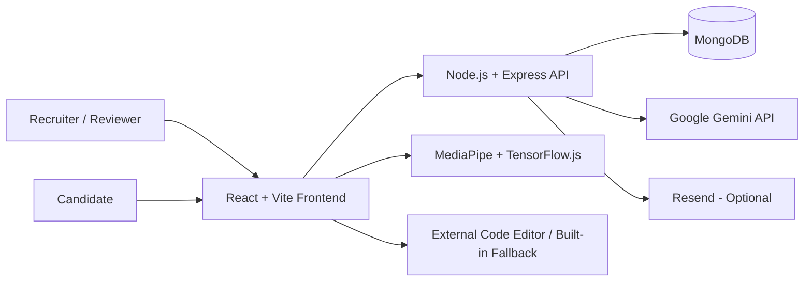

# InterviewBuddy – AI-Powered Interview & Recruiting Platform

[](https://github.com/YashAgarwal-31/AI-Interviewer/actions/workflows/ci.yml)


InterviewBuddy is a full-stack AI-powered technical interviewing and recruitment platform. It enables recruiting teams to manage candidates, schedule secure interviews, conduct adaptive AI-driven technical assessments with voice and coding support, and review structured interview reports from a centralized recruiter workspace.

The project is built as a **production-oriented single-workspace platform** with named recruiter accounts, role-based access control, secure candidate invite links, persistent interview state, AI evaluation, monitoring signals, audit logs, CI checks, and deployment configuration.

> **Deployment status:** the application is code/build ready. Before inviting real candidates, deploy the production services and complete the live browser/provider smoke test in [DEPLOYMENT.md](./DEPLOYMENT.md).

## Product Screenshots

### Recruiter and Candidate Portal


### Candidate Shortlisting


### Interview Scheduling Process


### AI Interview Scheduler


### Secure Candidate Interview Entry


### AI Interview Experience


### AI-Powered Coding Assessment


### Candidate Project and Code Analysis


## How It Works

1. A recruiter signs in to the protected workspace and creates or selects a candidate.
2. The recruiter schedules an interview, configures skills/focus areas/coding, and issues a secure signed invite.
3. The candidate opens the invite; the backend validates the token, exact session, and allowed time window before granting access.
4. The AI interviewer conducts the assessment using candidate context, adaptive follow-up questions, text/voice interaction, and optional coding tasks.
5. Interview state, transcript, coding submissions, and optional browser integrity signals are persisted during the session.
6. On completion, InterviewBuddy creates a structured technical evaluation and exposes the report to authorized recruiters/reviewers.

## Architecture



### Production model

- **Frontend:** React 19, Vite 7, React Router 7, Tailwind CSS
- **Backend:** Node.js 20.19+, Express, MongoDB/Mongoose
- **AI:** Google Gemini API for interview conversation and technical evaluation
- **Monitoring:** MediaPipe + TensorFlow.js/COCO-SSD in the candidate browser
- **Email:** Resend (optional)
- **Deployment:** Vercel frontend + Render backend + MongoDB

## Key Features

### Recruiter workspace
- Owner, Admin, Recruiter, and Reviewer roles with least-privilege access
- Dashboard KPIs and recent interview activity
- Searchable candidate management with create, view, edit, delete, and pagination
- 15–240 minute interview scheduling with skills, focus areas, custom questions, and coding configuration
- Invite/reminder actions, cancellation, session filtering, and operational status
- Searchable interview reports, readable transcripts, AI evaluation, and CSV export
- Team administration, password resets, account disable/enable, profile settings, and sign-out-everywhere
- Audit log and system-status views for Owner/Admin users

### Live candidate interview
- Signed, time-bound invite access; candidate IDs are identifiers, never passwords
- Exact session resolution from signed links
- Tab-scoped candidate credentials using `sessionStorage`
- Invite secret transported in the URL fragment and removed from browser history after capture
- Text answers with browser speech-recognition input and interviewer text-to-speech
- Countdown timer plus server-side cancellation/expiry/completion enforcement
- Feature-aware coding flow enforced by the frontend, backend, and AI prompt
- Secure external-editor bridge using origin-checked `postMessage`; access tokens are never sent to the editor
- Built-in code-submission fallback
- Optional camera/microphone monitoring with lazy-loaded face/object/audio analysis

### Results and evaluation
- Persisted interview report with transcript, duration, question/answer counts, and coding-submission count
- Google Gemini-generated technical score, recommendation, summary, strengths, and concerns
- Evaluation instructions treat candidate transcript as untrusted data and exclude protected-trait/personality judgments
- Browser integrity signals are stored separately as recruiter review aids and are not included in the AI technical score
- Retry-safe completion returns an existing persisted report instead of intentionally creating duplicates
- Spreadsheet-safe CSV export

### Security and reliability
- Recruiter passwords hashed with Node `scrypt` and per-user random salts
- Opaque recruiter sessions stored as hashes with TTL expiry
- Login lockout, RBAC, request IDs, payload limits, CORS allowlisting, production HSTS, and rate limiting
- Candidate invite-token hashes stored instead of plaintext
- Invite/reminder credential rotation with rollback on failed email delivery
- Token rotation blocked after an interview has started
- MongoDB connection pooling/indexes, Google Gemini timeout/retries, health checks, and graceful shutdown
- Legacy credential-issuing session creation disabled in production

## Tech Stack

| Layer | Technologies |
|---|---|
| Frontend | React 19, Vite 7, React Router 7, Tailwind CSS, Lucide React |
| Backend | Node.js, Express.js, MongoDB, Mongoose |
| AI | Google Gemini API (Interactions API) |
| Browser AI / Monitoring | MediaPipe, TensorFlow.js, COCO-SSD |
| Auth & Security | Node Crypto, scrypt, hashed bearer sessions, RBAC |
| Optional Email | Resend |
| DevOps | GitHub Actions, Render, Vercel |

## Main Routes

**Candidate**

- `/` and `/interview` — signed invite validation
- `/interview-session` — validated live interview workspace

**Recruiter**

- `/platform/login` — sign-in / first-owner bootstrap
- `/platform` — dashboard
- `/platform/schedule` — interview operations
- `/platform/candidates` — candidate management
- `/platform/results` — reports and export
- `/platform/team` — Owner/Admin team management
- `/platform/audit` — audit log and system status
- `/platform/settings` — account/password/session settings

## Local Development

### Backend

```bash
cd backend
cp .env.example .env
npm install
npm run dev
```

### Frontend

```bash
cd frontend
cp .env.example .env
npm install
npm run dev
```

Default frontend: `http://localhost:5173`  
Default backend: `http://localhost:3000`

## Production Requirements

Production startup requires:

```text
MONGO_URI
ADMIN_API_KEY
GEMINI_API_KEY
FRONTEND_URL or PRODUCTION_FRONTEND_URL/CORS_ORIGINS
```

Google Gemini is optional only for local development fallback behavior. Production intentionally fails closed without `GEMINI_API_KEY` so the advertised AI interview/evaluation functionality is available.

Create the key in [Google AI Studio](https://aistudio.google.com/apikey), then set `GEMINI_API_KEY`. The default model is `gemini-3.8-flash`; override it with `GEMINI_INTERVIEW_MODEL`. The backend uses the stateless Gemini Interactions REST API and does not expose the key to the browser.

Resend is optional. Configure `RESEND_API_KEY` and `FROM_EMAIL` only when email invitations/reminders are needed.

## CI Quality Gate

GitHub Actions validates both applications on pushes to `main` and on pull requests.

**Backend**

```bash
npm ci
npm audit --omit=dev
npm test
npm run check
```

**Frontend**

```bash
npm ci
npm audit --omit=dev
npm run lint
npm test
npm run build
```

Regression tests cover authentication/token primitives, production session-state rules, CSV-export safety, API security headers, CORS rejection, request-size enforcement, health/not-found behavior, graceful shutdown, and fail-closed production startup.

## Deployment

The repository includes:

- [`render.yaml`](./render.yaml) — Render backend configuration
- [`frontend/vercel.json`](./frontend/vercel.json) — Vercel SPA routing and browser security headers
- backend/frontend `.env.example` files
- [`DEPLOYMENT.md`](./DEPLOYMENT.md) — production environment setup, launch order, browser/device checks, and live smoke-test checklist


## Security Notes

- Never commit `.env` files, API keys, recruiter passwords, candidate invitation URLs, or raw access tokens.
- Keep `ADMIN_API_KEY` private and use it only for first-owner bootstrap/recovery.
- Keep `ENABLE_DEMO_MODE=false` in production.
- Candidate IDs are identifiers, not authentication credentials.
- Enable MongoDB backups and hosting/provider monitoring before real production usage.

## Latest Reliability and Security Hardening

The latest **main** branch includes an additional production-hardening pass focused on concurrency, data integrity, AI safety, browser security, and end-to-end verification.

### Reliability improvements

- Interview mutations for the same session are serialized to prevent overlapping answer, monitoring, initialization, and completion requests from corrupting state.
- Browser integrity events are appended atomically and retained independently from transcript updates.
- Interview state updates preserve concurrently received monitoring signals.
- Interview results enforce a unique **sessionId**, preventing duplicate result records.
- Completion is retry-safe and recovers the session state when a result was stored before finalization completed.
- Resend configuration is loaded lazily, so values supplied through the local backend environment file are available after dotenv initialization.

### AI and application security

- Candidate profile, resume, project, custom-question, and coding-task content is explicitly isolated as untrusted reference data in the AI prompt.
- Candidate-controlled prompt delimiters are escaped before they reach the model.
- AI evaluation requests use structured JSON output and retain safe fallback behavior when evaluation is unavailable.
- External coding-editor messages must match both the configured origin and the exact iframe window.
- Editor payloads are normalized and bounded before submission.
- The frontend deployment configuration includes Content Security Policy, cross-origin isolation, referrer, permissions, framing, and content-type protections.
- The built-in coding area is accurately described as a code-submission path for AI/recruiter review; code execution remains the responsibility of the configured external editor.

### Expanded automated verification

The CI workflow now starts a real MongoDB 7 service and tests the complete core journey:

1. Bootstrap the first platform owner.
2. Create a candidate.
3. Schedule a secure interview.
4. Validate the signed candidate invitation.
5. Initialize the live interview.
6. Persist a candidate answer and monitoring signal submitted concurrently.
7. Complete the interview and retrieve its report.
8. Retry completion safely.
9. Confirm that only one result exists for the session.

The current automated quality gate covers:

- **Backend:** 21 tests
- **Frontend:** 10 tests
- **Database integration:** Real MongoDB-backed recruiter-to-result flow
- **Security:** Production dependency audits for backend and frontend
- **Quality:** Backend syntax checks, frontend ESLint, and frontend production build

Live Google Gemini responses, Resend delivery, camera/microphone permissions, speech recognition, MediaPipe model delivery, and the external coding editor still require their respective credentials, providers, network access, and a supported browser/device. Follow the live smoke-test checklist in [DEPLOYMENT.md](./DEPLOYMENT.md) before inviting real candidates.

